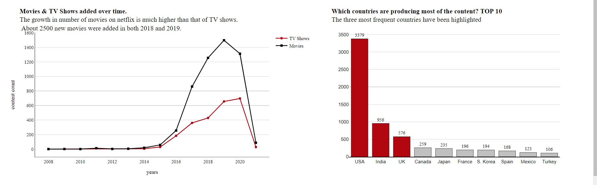
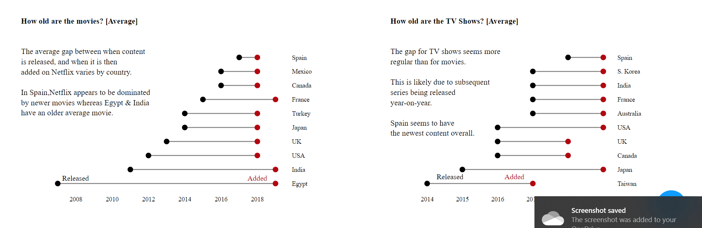

# Visualisation Evaluation

Netflix has achieved incredible growth over the past decade, both in terms of subscribers and revenue. Netflix is available for viewers to watch in 110 countries worldwide, with international subscribers feeding most of its impressive rise over the past several years. However, the question is, given all these great results, what is there on Netflix? What content allows Netflix to nearly double its revenue in just three years, showing $ 20.15 billion in 2019, as the number of paid subscribers continues to grow despite the rise in the subscription price? Does Netflix have more TV shows or Movies? How 'old' is the content on Netflix? 

The analysis is mainly based on TV shows and movies Netflix list dataset obtained from [kaggle.com](https://www.kaggle.com), which relies primarily on data collected from the website [flixable.com](https://flixable.com), a third-party Netflix search engine. The dataset consists of TV shows and movies available on Netflix until the last version of January 2021.

After cleaning up, restructuring and formatting the data, we chose to focus on the type of content and countries participating in Netflix the most. We used a line chart to explore the amount of content Netflix has added throughout the previous years. Since we are interested in when Netflix added the title onto their platform, we added a "year_added" column to show the date from the "date_added" columns. The growth in the number of movies added to Netflix much higher than TV shows. About 3000 new movies were added in the last three years. Growth in content started in 2013. Netflix has continued to add various movies and TV shows to its platform over the years. This content was from a variety - content from different countries, content released over the years. Although the line chart shows the most important points, which is that movies added to Netflix have doubled TV shows and the years in which content has been added to Netflix are clear, there is an opportunity to be misled as it shows a significant drop in 2021, but in fact, we only have the first month of this year.

Looking at the dynamics of the increase in the number of movies and TV shows over time, we explored the countries by the amount of content produced by Netflix. We separate all countries within the movie before analyzing it, then remove titles for which there are no countries. Using a bar chart, we plot the ten most significant Netflix contributors. The country with the amount of content produced in the United States. The second most-producer country is India, which surpasses both the United Kingdom and Canada in the number of titles produced that can be streamed on Netflix.

The purpose of the last two plots was to show the age of movies and TV shows using the years of the original release because when we plotted the amount of content as a function of time, we noticed that most of the content had been added in the past three years. The plots show that the average gap between when content is released and when it is then added on Netflix varies by country.

Speaking of colours, we have tried Netflix's brand colours. [Netflix Brand Colours](https://brand.netflix.com/assets/brand-symbol/). As using a consistent colour palette is a helpful way to add credibility to a business. It looks consistent and keeps the reader engaged. However, we design our dashboard in a light grey background to use as a nifty layout and organizing device to subtly separate the different panels of the screen without the need for shoutier backgrounds or intrusive borders.

Due to the limited scope of the analysis, a certain amount of meaningful questions could not have been answered. With broader access to data, several additional valuable insights can be generated. Some of the issues worth exploring may include:
- Is there content more suitable for children or adults?
- Are there more documentaries, comedies, thrillers, actions, or dramas?
- Who actors do we often see on Netflix?
- Is the average length of the movie gradually increasing as more and more opportunities for consumers to enjoy it in the comfort of their own homes?

We can also combine the original dataset with the data on the number of subscribers that Netflix had when the title is added to the Netflix streaming library so that we can show the number of subscribers on Netflix, as well as the dynamics of the subscriber base growth and its correlation with the number of titles added.

Overall, we have drawn many interesting inferences from the Netflix titles dataset; Here is a summary of some of them:
- The most common types of content on Netflix are movies.
- The popular streaming platform started gaining traction after 2013. Since then, the volume of added content has grown exponentially.
- The country by the amount of content produced is the United States.
- Most of the content has been added in the last three years, even though it was released earlier.
